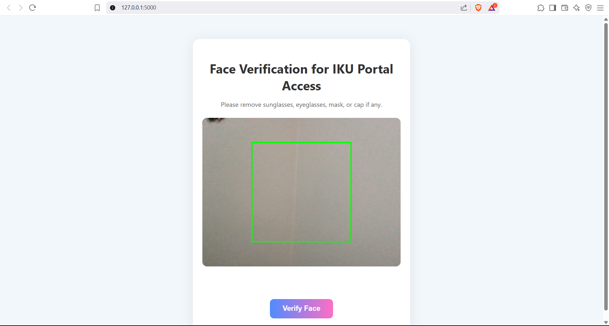

# 🔐 Deepfake Detection Gateway for IKU Portal

This project is a **secure, multimodal verification system** that uses **face and voice authentication** to grant access to the Istanbul Kültür University (IKU) portal. It ensures that only real users — not deepfakes — can pass through.

> 🔍 Uses Deep Learning-based **image + audio** models to detect deepfake content in real-time.

---



---

## 🚀 Key Features

- 🔒 **Dual-Modality Deepfake Detection** (Image + Audio)
- 🎥 Face verification from live webcam video
- 🎤 Audio verification via 5-second voice capture
- 🛡️ Strong **security enforcement** (rate limiting, IP checks, hashing, encryption)
- 📊 SQLite-based logging and forensic tracking
- 🌐 Web-based interface with progress bars and real-time feedback

---

## 🧠 Model Architecture

The backend uses two separate CNN-based models for classification:


- Image Input: 15 face frames
- Audio Input: 5-second speech segment → Mel spectrogram → CNN prediction

---

## 🏗️ System Architecture

- **Frontend:** HTML5 + JS webcam/audio recording
- **Backend:** Flask (Python)
- **Image Processing:** OpenCV, PIL, Keras
- **Audio Processing:** Librosa, Pydub, Matplotlib
- **Database:** SQLite3
- **Security:** HTTPS headers, hash verification, IP/VPN filtering

---

## 🛠️ Tech Stack

| Layer       | Tools / Libraries                          |
|-------------|---------------------------------------------|
| Frontend    | HTML5, JavaScript, Webcam & Audio APIs     |
| Backend     | Flask, TensorFlow / Keras, SQLite3         |
| Audio       | Librosa, Pydub, Matplotlib                 |
| Image       | PIL, OpenCV, Histogram Equalization, CNN   |
| Security    | SHA-256, AES-GCM, CSP, Rate Limiting       |

---

## 🔐 Security Features

✅ AES-256 and AES-GCM encryption  
✅ SHA-256 hashing for file and folder verification  
✅ Rate limiting: 10/min, 50/hr, 200/day  
✅ Country check (Turkey-only via IP)  
✅ VPN/Proxy detection  
✅ Secure cookies + session validation  
✅ CORS and CSP headers  
✅ File type & size restrictions  
✅ Full audit logging with timestamps and file hashes

---

## 🧪 Running the Project

1. **Clone the repository**

```bash
git clone https://github.com/your-username/IKU-Face-Gateway.git
cd IKU-Face-Gateway

